# leetcode刷题笔记


## 二叉树的遍历

**刷题过程的一些疑惑点**

**关于二叉树的自顶向下(前序遍历)和自底向上(后续遍历)**

> 前序遍历是先获取到根节点的信息，然后做一定编码后，再向下操作，遍历过程可以携带一定的信息再往下遍历，先处理得到临时性结果。
>
> 后续遍历是先遍历到叶子节点，然后再向上处理根节点，再返回，后续的处理是根据子树值作为入参

### 1.前中后序遍历

#### [144 二叉树的前序遍历](https://link.juejin.cn/?target=https%3A%2F%2Fleetcode-cn.com%2Fproblems%2Fbinary-tree-preorder-traversal%2Fsolution%2F)

先遍历根节点，在遍历左子节点，再遍历右子节点

```js
var preorderTraversal = function(root) {
    let res = []
    function preOrder(root) {
        if(!root) return;
        res.push(root.val)
        preOrder(root.left);
        preOrder(root.right);
    }
    preOrder(root, res);
    return res;
};
```

#### [194 二叉树的中序遍历](https://link.juejin.cn/?target=https%3A%2F%2Fleetcode-cn.com%2Fproblems%2Fbinary-tree-inorder-traversal%2F)

先遍历左子节点，在遍历根节点，再遍历右子节点

```js
var preorderTraversal = function(root) {
    let res = []
    function preOrder(root) {
        if(!root) return;
        res.push(root.val)
        preOrder(root.left);
        preOrder(root.right);
    }
    preOrder(root, res);
    return res;
};
```

```js
var inorderTraversal = function(root) {
    let res = [];
    let stack = [];
    while(root || stack.length) {
        if(root) {
            stack.push(root);
            root = root.left;
        }else{
            root = stack.pop();
            res.push(root.val);
            root = root.right;
        }
    }
    return res;
};
```


####  [145 二叉树的后序遍历](https://link.juejin.cn/?target=https%3A%2F%2Fleetcode-cn.com%2Fproblems%2Fbinary-tree-postorder-traversal%2Fsubmissions%2F)

先遍历左子节点，再遍历右子节点，再遍历根节点

```js
var postorderTraversal = function(root) {
    let res = [];
    dfs(root);
    return res;
    function dfs(root) {
        if(!root) return;
        dfs(root.left);
        dfs(root.right);
        res.push(root.val);
    }
};
```

```js
var postorderTraversal = function(root) {
    //用栈来实现后序遍历
    let res = [];//结果集
    if (!root) return res;//root为空 则直接返回res
    const stack = [root];//定义一个数组当作栈 并把root添加进去
    
    while(stack.length) {//栈非空
        let node = stack.pop();//元素出栈
        res.push(node.val);//当前节点值放进res
        if(node.left) stack.push(node.left);//按照前序遍历的左右节点逆序进栈 然后翻转结果集
        if(node.right) stack.push(node.right);
    }
    return res.reverse();//翻转结果集
};
```

### 2.自底向上的例子

#### [563. 二叉树的坡度](https://link.juejin.cn/?target=https%3A%2F%2Fleetcode-cn.com%2Fproblems%2Fbinary-tree-tilt%2Fsolution%2Fzi-di-xiang-shang-by-jzsq_lyx-24re%2F)

```js
//分析
//1. 自底向上返回子树值之和，然后求出对应的坡度，累加起来即可.
//2. 需要注意的是，左右子树的累加值大小不确定，需要用绝对值
//3. 时间复杂度 ${O(N)}$
var findTilt = function(root) {
    let res = 0;
    function dfs(root) {
        if(!root) return 0;
        let left = dfs(root.left);
        let right = dfs(root.right);
        res += Math.abs(left - right);
        return left + right + root.val;
    }
    dfs(root);
    return res;
};
```

####  [104. 二叉树的最大深度](https://link.juejin.cn/?target=https%3A%2F%2Fleetcode-cn.com%2Fproblems%2Fmaximum-depth-of-binary-tree%2Fsolution%2Fceng-xu-bian-li-zi-ding-xiang-xia-de-dfs-hjvi%2F) 自底向上

```js
var maxDepth = function(root) {
    return dfs(root);
    function dfs(root) {
        if(!root) return 0;
        let left = dfs(root.left);
        let right = dfs(root.right);
        return Math.max(left, right) + 1;
    }
};
```

### 3.自定向下的例子

#### [1022. 从根到叶的二进制数之和](https://link.juejin.cn/?target=https%3A%2F%2Fleetcode-cn.com%2Fproblems%2Fsum-of-root-to-leaf-binary-numbers%2Fsolution%2Fzi-ding-xiang-xia-qiu-zhi-by-jzsq_lyx-wsyc%2F)

```js
var sumRootToLeaf = function(root) {
    let res = 0;
    function dfs(root, digit) {
        if(!root.left && !root.right) {
            res += (digit << 1) + root.val;
        }
        if(root.left) dfs(root.left, (digit << 1) + root.val);
        if(root.right) dfs(root.right, (digit << 1) + root.val); 
    }
    dfs(root, 0);
    return res;
};
```

#### [104. 二叉树的最大深度](https://link.juejin.cn/?target=https%3A%2F%2Fleetcode-cn.com%2Fproblems%2Fmaximum-depth-of-binary-tree%2Fsolution%2Fceng-xu-bian-li-zi-ding-xiang-xia-de-dfs-hjvi%2F) 自顶向下

```js
var maxDepth = function(root) {
    if(!root) return  0;
    let res = Number.MIN_VALUE;
    function dfs(root, depth) {
        if(!root.left && !root.right) {
            res = Math.max(res, depth)
        }
        if(root.left) dfs(root.left, depth + 1);
        if(root.right) dfs(root.right, depth + 1)
    }
    dfs(root, 1);
    return res;
};
```


## 回溯法

### 1.组合


```js
let res = [];// 定义数组保存所有结果
let path = [];// 定义数组保存每一次的路径
var combine = function(n, k) {
    backTrack(n, k, 1);// 开始回溯 1为开始位
    return res;
};
function backTrack(n, k, start) {
    if(path.length === k) {// 如果当前个数等于k
        res.push([...path]);// 把走过的路径加入结果res中，path要变成一个新的引用 所以要解构运算符
        return;// 返回上一层
    }
    for(let i = start; i <= n; i++) {// 每一层进行横向遍历
        path.push(i);// 将每一次遍历的数字加入path中
        backTrack(n, k, i + 1);// 递归遍历 纵向遍历
        path.pop();// 清除上面的操作
    }
}
```

### 2.组合Ⅲ

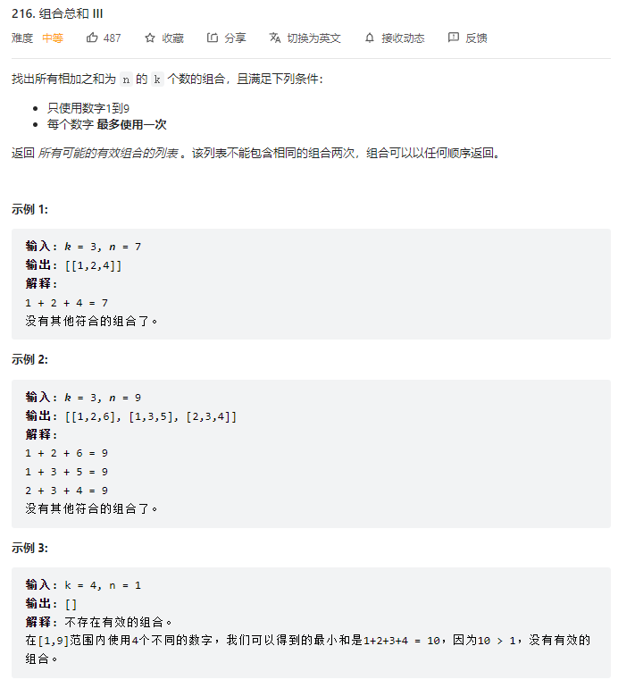

```js
var combinationSum3 = function(k, n) {
    let res = [];// 保存所有结果
    let path = [];// 保存某个符合条件的结果
    function backTrack(sum, start) {// 回溯函数
        if(path.length === k) {
            if(sum === n) res.push([...path]);
            return;
        }
        for(let i = start; i <= 9; i++) {
            sum += i;// sum加i 并把i推进路径中
            path.push(i);
            backTrack(sum, i + 1);// 其实可以直接把sum的操作丢尽函数的参数中
            sum -= i;// 清除上面的操作
            path.pop();
        }
    }
    backTrack(0, 1);
    return res;
};
```

### 3.电话号码的字母组合

```js
var letterCombinations = function(digits) {
    if(digits === '') return []
    let res = [];// 定义res保存结果
    let map = {// 需要使用map对象把数字和字母作一个映射
        2 : 'abc',
        3 : 'def',
        4 : 'ghi',
        5 : 'jkl',
        6 : 'mno',
        7 : 'pqrs',
        8 : 'tuv',
        9 : 'wxyz'
    }
    function backTrack(str, i) {// str是当前遍历得到的字符串 i用来记录遍历到第几个数字
        if(i === digits.length) {// 由i来进行纵向遍历 出口为i遍历完了传进来的整个数字字符串
            res.push(str);// 添加到结果集
            return;// 返回上一层
        }
        letters = map[digits[i]];// 获取当前遍历到的数字对应的字符串
        for(let s of letters) {// 横向遍历 遍历字符串中的每一个字符
            backTrack(str + s, i + 1);// 纵向遍历 拼接字符串，并且digits的下标加1 遍历下一个字符串
        }
    }
    backTrack('', 0);
    return res;
};
```

### 4.全排列


```js
var permute = function(nums) {
    let res = [];// 保存结果
    let path = [];// 保存每次的排列
    let n = nums.length;
    let used = [];// 记录数字是否被使用了，避免数字重复使用
    backTrack(nums);// 对nums进行回溯
    return res;// 返回结果
    function backTrack() {
        if(nums.length === path.length) {// 当前排列长度等于数组长度
            res.push([...path]);// 将path深拷贝给res
            return;// 返回上一层
        }
        for(let i = 0; i < n; i++) {// 横向遍历
            if(used[i]) continue;// 数字使用过就跳过
            used[i] = true;// 对使用过的数字进行标记
            path.push(nums[i]);// 把当前数字存入path
            backTrack(nums);// 纵向遍历 调用backTrack
            path.pop();// 清空上面的操作
            used[i] = false; 
        }
    }
};
```

### 5.全排列Ⅱ


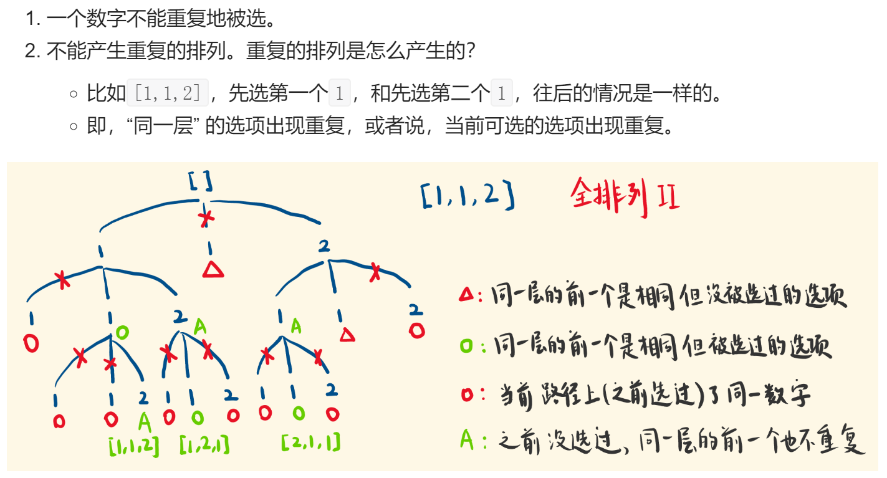

```js
var permuteUnique = function(nums) {
    nums.sort((a, b) => a - b);// 先进行排序 为之后去重作准备
    let res = [];
    let path = [];
    let used = [];
    backTrack(nums);
    return res;
    function backTrack(nums) {
        if(nums.length === path.length) {
            res.push([...path]);
            return;
        }
        for(let i = 0; i < nums.length; i++) {
            // used[i]为true说明当前路径该数字被使用过 used[i-1]同一层相同且未被使用
            if(used[i] || i > 0 && nums[i] == nums[i - 1] && !used[i - 1]) continue;
            used[i] = true;
            path.push(nums[i]);
            backTrack(nums);
            path.pop();
            used[i] = false;
        }
    }
};
```

⑥✨递增子序列


```js
var findSubsequences = function(nums) {
    let res = [];
    let path = [];
    backTrack(0);
    return res;
    function backTrack(start) {
        if(path.length >= 2) {
            res.push([...path]);
        }
        let set = new Set();
        for(let i = start; i < nums.length; i++) {
            // 同一层出现重复数字或当前数字小于路径path保存的最后一个（即不是递增）则跳过
            if(set.has(nums[i]) || nums[i] < path[path.length - 1]) continue;
            set.add(nums[i]);
            path.push(nums[i]);
            backTrack(i + 1);
            path.pop();
        }
    }
};
```

### 6.子集


```js
var subsets = function(nums) {
    let res = [];
    let path = [];
    backTrack(0);
    return res;
    function backTrack(start) {
        res.push([...path]);
        for(let i = start; i < nums.length; i++) {
            path.push(nums[i]);
            backTrack(i + 1);
            path.pop();
        }
    }
};
```

### 7.子集Ⅱ

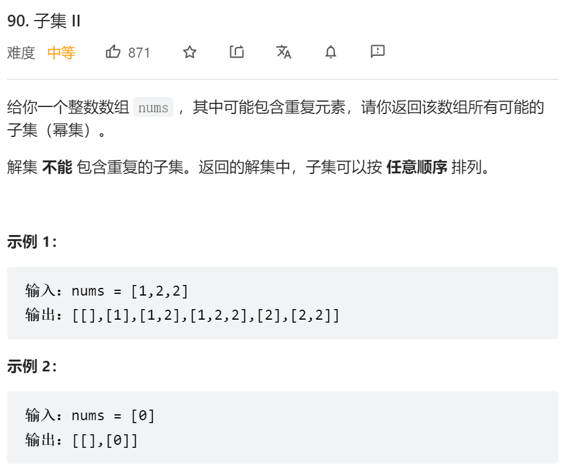

```js
var subsetsWithDup = function(nums) {
    nums.sort((a, b) => a - b);
    let res = [];
    let path = [];
    backTrack(0);
    return res;
    function backTrack(start) {
        res.push([...path]);
        let set = new Set();
        for(let i = start; i < nums.length; i++) {
            if(set.has(nums[i])) continue;
            set.add(nums[i]);
            path.push(nums[i]);
            backTrack(i + 1);
            path.pop();
        }
    }
};
```

### 8.组合总和 

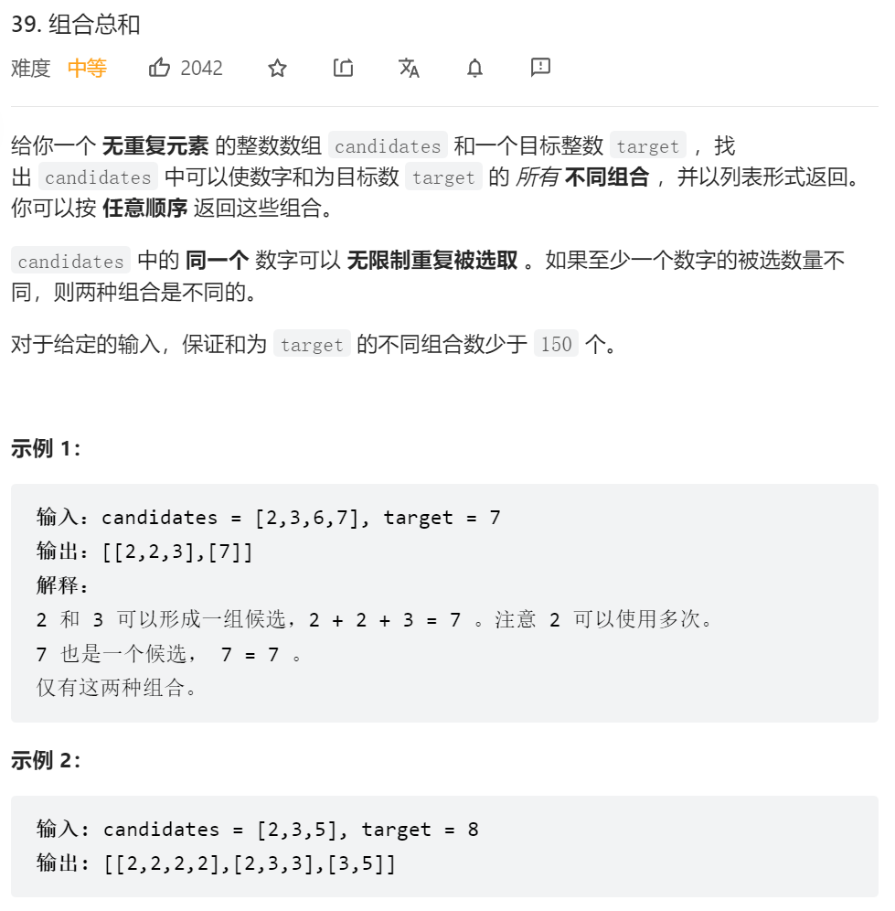

```js
var combinationSum = function(candidates, target) {
    let res = [];
    let path = [];
    backTrack(0, target);
    return res;
    function backTrack(start, target) {
        if(target < 0) return;
        if(target === 0) {
            res.push([...path]);
            return;
        }
        for(let i = start; i < candidates.length; i++) {
            path.push(candidates[i]);
            backTrack(i, target - candidates[i]);// i-->可以重复使用自身
            path.pop();
        }
    }
};
```

### 9.组合总和

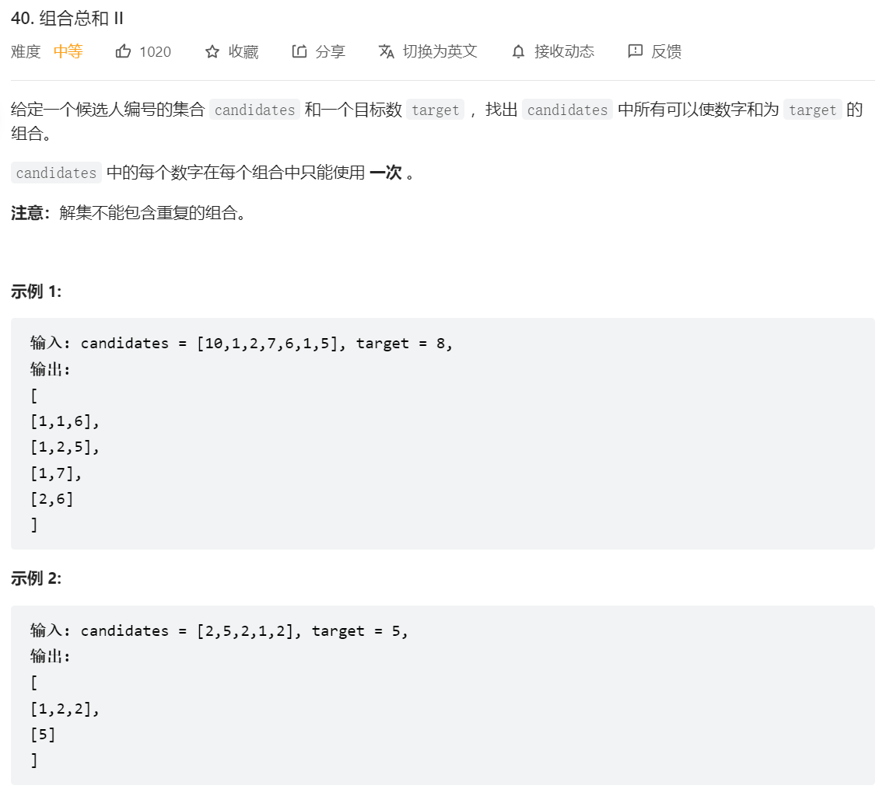

```js
var combinationSum2 = function(candidates, target) {
    candidates.sort((a, b) => a - b);
    let res = [];
    let path = [];
    backTrack(target, 0);
    return res;
    function backTrack(target, start) {
        if(target < 0) return;
        if(target === 0) {
            res.push([...path]);
            return;
        }
        let set = new Set();// 去除同一层的相同元素
        for(let i = start; i < candidates.length; i++) {
            if(set.has(candidates[i])) continue;
            set.add(candidates[i]);
            path.push(candidates[i]);
            backTrack(target - candidates[i], i + 1);
            path.pop();
        }
    }
};
```

### 10.电话号码的字母组合


```js
var letterCombinations = function(digits) {
    if(digits === '') return []
    let res = [];// 定义res保存结果
    let map = {// 需要使用map对象把数字和字母作一个映射
        2 : 'abc',
        3 : 'def',
        4 : 'ghi',
        5 : 'jkl',
        6 : 'mno',
        7 : 'pqrs',
        8 : 'tuv',
        9 : 'wxyz'
    }
    function backTrack(str, i) {// str是当前遍历得到的字符串 i用来记录遍历到第几个数字
        if(i === digits.length) {// 由i来进行纵向遍历 出口为i遍历完了传进来的整个数字字符串
            res.push(str);// 添加到结果集
            return;// 返回上一层
        }
        letters = map[digits[i]];// 获取当前遍历到的数字对应的字符串
        for(let s of letters) {// 横向遍历 遍历字符串中的每一个字符
            backTrack(str + s, i + 1);// 纵向遍历 拼接字符串，并且digits的下标加1 遍历下一个字符串
        }
    }
    backTrack('', 0);
    return res;
};
```


## 贪心算法

### 1.分发饼干


```js
var findContentChildren = function(g, s) {
    g.sort((a, b) => a - b);//对两个数组进行排序
    s.sort((a, b) => a - b);
    let res = 0;//能满足的人数
    let index = 0;//人数下标
    for(let i = 0; i < s.length; i++) {//遍历饼干数组
    //当前遍历人数不超出总人数且饼干能满足小孩胃口 则res++ 轮到下一个小孩index++
        if(index < g.length && s[i] >= g[index]){
            res++;
            index++;
        }
    }
    return res;
};
```

```java
class Solution {
    public int findContentChildren(int[] g, int[] s) {
        Arrays.sort(g);//对两者进行排序
        Arrays.sort(s);
        int res = 0;//能满足的人数
        int index = 0;//标记每一个人
        for(int i = 0; i < s.length; i++){//遍历饼干----也可以换成先遍历人 要倒过来遍历
            //找到胃口小于等于饼干的 就记录一次res++ 并换另一个小孩 index++
            if(index < g.length && g[index] <= s[i]){
                res++;
                index++;
            }          
        }
        return res;
    }
}
```

### 2摆动序列


```js
//动态规划
var wiggleMaxLength = function(nums) {
    let max = 1;
    let n = nums.length;
    let up = Array(n).fill(1);
    let down = Array(n).fill(1);
    for(let i = 1; i < n; i++) {
        if(nums[i] > nums[i - 1]) {//当前为升序
            up[i] = down[i - 1] + 1;// 则由前一个降序长度+1
            down[i] = down[i - 1];//当前降序长度不变
        }else if(nums[i] < nums[i - 1]) {
            down[i] = up[i - 1] + 1;
            up[i] = up[i - 1];
        }else {//若为平坡
            up[i] = up[i - 1];//则升序长度和降序长度均不变
            down[i] = down[i - 1];
        }
        max = Math.max(max, up[i], down[i]);//取最大值
    }
    return max;
};
```


```java
class Solution {
    public int wiggleMaxLength(int[] nums) {
        if(nums.length < 2) return nums.length;//如果长度为1 则返回当前长度
        int res = 1;//摆动序列最长子序列的长度 res至少为1
        int curDiff = 0;//当前两个数的差值
        int preDiff = 0;//一开始为0 后面被赋值为curDiff
        for(int i = 1 ; i < nums.length; i++){
            curDiff = nums[i] - nums[i - 1];
            //如果当前差值和前一个差值异号则 res++ preDiff置为当前差值
            //为什么会有等于0 因为一开始preDiff设置为0了
            if((curDiff > 0 && preDiff <= 0) || (curDiff < 0 && preDiff >= 0)){
                res++;//若出现异号则记录一次
                preDiff = curDiff;//前一个差值赋值为当前差值
            }
        }
        return res;
    }
}
```

### 3.最长湍流子数组

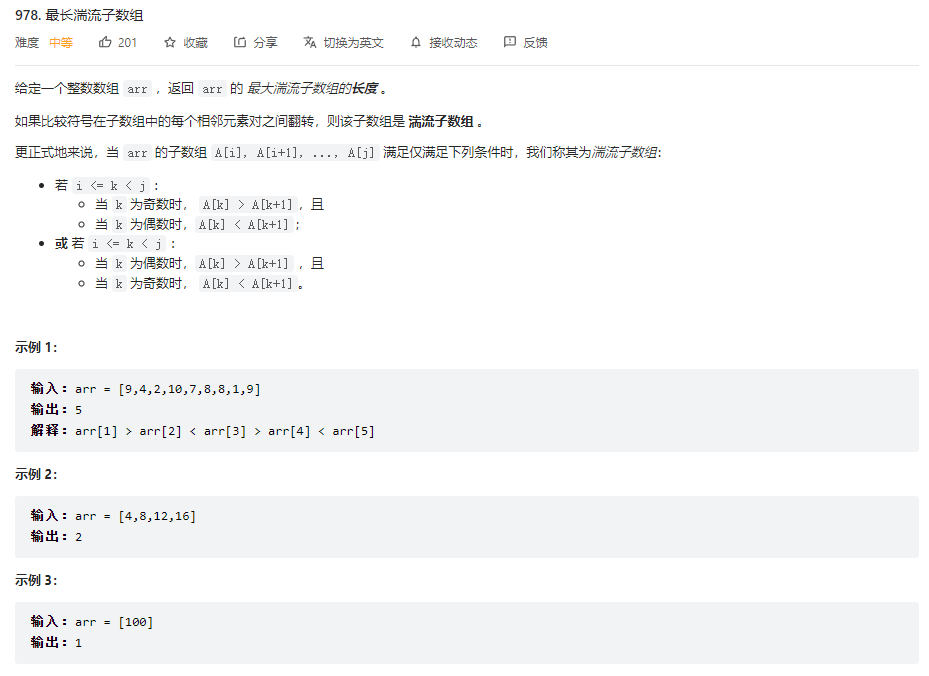

```JS
var maxTurbulenceSize = function(arr) {
    // 动态规划：
    // up[i]：当前趋势为升序的子数组长度
    // down[i]: 当前趋势为降序的组数组长度
    // 初始值均为1
    // 由arr[i] - arr[i - 1]来判断当前趋势
    // 降序趋势的长度由前一个升序趋势的长度来决定
    let n = arr.length;
    let up = Array(n).fill(1);
    let down = Array(n).fill(1);
    let max = 1;
    for(let i = 1; i < arr.length; i++) {
        if(arr[i] > arr[i - 1]) {
            up[i] = down[i - 1] + 1;
            // down[i] = 1;
        }else if(arr[i] < arr[i - 1]) {
            down[i] = up[i - 1] + 1;
            // up[i] = 1;
        }
        max = Math.max(max, up[i], down[i]);
    }
    return max;
};
```


```java
class Solution {
    public int maxTurbulenceSize(int[] arr) {
        int maxLength = 1;
        int max = 1;
        int n = arr.length;
        int[] up = new int[n];
        int[] down = new int[n];
        Arrays.fill(up, 1);
        Arrays.fill(down, 1);
        for(int i = 1; i < n; i++){
            if(arr[i] > arr[i - 1]){//当前为升序趋势
                up[i] = down[i - 1] + 1;//升序长度 = 前面降序长度+1
            }else if(arr[i] < arr[i - 1]){//当前为降序趋势
                down[i] = up[i - 1] + 1;//降序长度 = 前面升序长度+1
            }
            //等于不更新当前数组 因为本来就是默认为1
            max = Math.max(max, Math.max(up[i], down[i]));
        }
        return max;
    }
}
```

### 4.最大子数组和

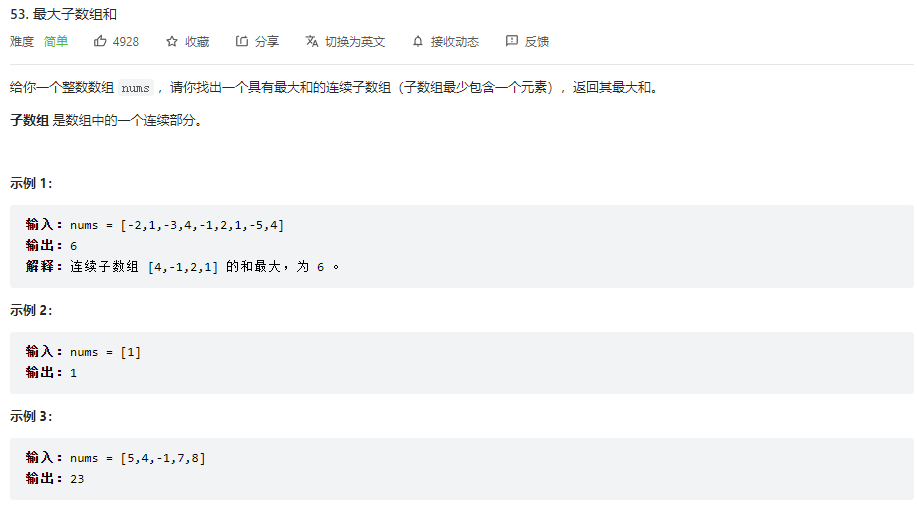

```js
var maxSubArray = function(nums) {
    let max = nums[0];
    let sum = 0;
    for(let num of nums) {
        sum = Math.max(sum + num, num);//比较当前连续子数组和与当前元素的大小 若小于则弃掉前面的
        max = Math.max(sum, max);//记录连续子数组和最大值
    }
    return max;
};
```

```js
var maxSubArray = function(nums) {
    //dp动态规划
    let dp = [];
    dp[0] = nums[0];
    let max = nums[0];
    for(let i = 1; i < nums.length; i++) {
        dp[i] = Math.max(dp[i - 1] + nums[i], nums[i]);
        max = Math.max(dp[i], max);
    }
    return max;
};
```

### 5.买卖股票的最佳时机系列

#### 5.1买卖股票的最佳时机Ⅰ


```js
var maxProfit = function(prices) {
    let min = prices[0];
    let max = 0;
    for(let price of prices) {
        min = Math.min(price, min);
        max = Math.max(price - min, max);
    }
    return max;
};
```

### 6.跳跃游戏系列

#### 6.1跳跃游戏Ⅰ


```js
var canJump = function(nums) {
    let maxCover = 0;
    for(let i = 0; i <= maxCover; i++) {//每次跳跃选择最大步数
        maxCover = Math.max(nums[i] + i, maxCover);//每次遍历更新覆盖范围
        if(maxCover >= nums.length - 1) {//覆盖范围超出或刚好等于数组长度则可以跳到最后
            return true;
        }
    }
    return false;
};
```

#### 6.2跳跃游戏Ⅱ


```js
var jump = function(nums) {
    let n = nums.length;
    let currentEdg = 0;//当前跳跃的最大范围/边界
    let nextEdg = 0;// 下一跳的最大范围
    let step = 0;//记录步数
    for(let i = 0; i < n - 1; i++) {// i<n-1 是因为最后一个位置不需要再跳了 已经到达终点
        nextEdg = Math.max(i + nums[i], nextEdg);// 更新下一跳的最大范围
        // 如果当前遍历已经达到本次跳跃最大范围 必须跳一下了 当然并不是必定在i的位置跳,必须在这范围内跳而已
        if(i === currentEdg) {
            currentEdg = nextEdg;//当前边界更新为下一个边界
            step++;
        }
    }
    return step;
};
```

### 7.k次取反后最大化的数组和


```js
// nums可能全为正数 全为负数 或者正负都有
// 思路：
// 把负数都变为正数 若有剩余次数
// 则判断剩余次数 奇数：把绝对值最小的变负 偶数：直接抵消 不变
var largestSumAfterKNegations = function(nums, k) {
    nums.sort((a, b) => a - b);// 数组正序排列
    let index = 0;// 定义一个索引
    while(nums[index] < 0 && k > 0) {// 当前元素为负而且k次数也大于零
        nums[index] = -nums[index];// 则把负数转化为正数
        index++;// 索引加一
        k--;// k的次数减一
    }
    if(k > 0 && k % 2 != 0) {// k还有剩余而且剩余次数为奇数
        let min;// 定义最小值的下标索引
        if(index == nums.length) min = index - 1;// 全为负数 index刚好超出数组范围
        else if(index ==  0) min = index;// 全为整数 最小值小标为开始的0下标
        else min = nums[index] > nums[index - 1] ? index - 1 : index// 有正有负 判断index和它前面的哪个小 就把哪个修改为负
        nums[min] = -nums[min];
    }
    return nums.reduce((a, b) => a + b);// 处理完各种情况 直接求和并返回
};
```

### 8.分发糖果


```js
var candy = function(ratings) {
    let n = ratings.length;// 定义评分数组长度
    let candyCount = Array(n).fill(1);// 创建数组并设初始值为1
    for(let i = 1; i < n; i++) {// 从左开始遍历数组 
        if(ratings[i] > ratings[i - 1]) {// 后一个评分比前一个评分高 相反则保持1
            candyCount[i] = candyCount[i - 1] + 1;// 则后一个比前一个+1
        }
    }
    for(let i = n - 1; i > 0; i--) {// 从右往左遍历数组
        if(ratings[i] < ratings[i - 1]) {// 前一个比后一个平凡高的 必须要拿更多糖果 要么保持自己原来有的 要么比后一个多1 两者取最大，因为还要比它之前的多
            candyCount[i - 1] = Math.max(candyCount[i - 1], candyCount[i] + 1);
        }
    }
    return candyCount.reduce((a, b) => a + b);
};
```

### 9.根据身高重建队列


> 先按身高从大到小排列

排序完的people： [[7,0], [7,1], [6,1], [5,0], [5,2]，[4,4]]

插入的过程：

- 插入[7,0]：[[7,0]]
- 插入[7,1]：[[7,0],[7,1]]
- 插入[6,1]：[[7,0],[6,1],[7,1]]
- 插入[5,0]：[[5,0],[7,0],[6,1],[7,1]]
- 插入[5,2]：[[5,0],[7,0],[5,2],[6,1],[7,1]]
- 插入[4,4]：[[5,0],[7,0],[5,2],[6,1],[4,4],[7,1]]

```js
var reconstructQueue = function(people) {
    let n = people.length;
    // 对身高进行排序 由高到低 设数组people[i] = [hi, ki]
    for(let i = 0; i < n; i++) {
        people.sort((a, b) => {// 对数组people排序
            if(a[0] === b[0]){// 如果身高相等
                return a[1] - b[1]// 根据ki来排序 以ki进行正序排列
            }else {// 若身高不等
                return b[0] - a[0]// 根据身高来排序 这里是逆序 即由大到小
            }
        })
    }
    let queue = [];
    // 根据ki值依次把每一个人插入相应位置
    for(let i = 0; i < n; i++) {
        queue.splice(people[i][1], 0, people[i])
    }
    return queue;
};
```

### 10.用最少数量的箭引爆气球


```js
var findMinArrowShots = function(points) {
    let n = points.length;
    let count = 1;// 由于遍历是从第二个气球开始的 所以一开始先射一箭
    points.sort((a, b) => a[0] - b[0]);// 按照左边界将二维数组排序
    for(let i = 1; i < n; i++) {// 遍历二维数组 由第二个开始遍历
        // 当前气球左边界大于前一个气球的右边界 则必须要射箭了
        if(points[i][0] > points[i - 1][1]) {
            count++;
        }else {// 小于的话 则把当前的有边界更新成最小右边界
            points[i][1] = Math.min(points[i][1], points[i - 1][1]);
        }
    }
    return count;
};
```

### 11.合并区间


```js
var merge = function(intervals) {
    let res = [];// 定义一个数组保存不重复区间
    let n = intervals.length;
    intervals.sort((a, b) => a[0] - b[0]);// 对二维数组按照start来进行排序
    let pre = intervals[0];// pre拿到第一个区间
    for(let i = 0; i < intervals.length; i++) {// 遍历区间
        let cur = intervals[i];// 获取当前区间
        if(pre[1] >= cur[0]) {// 如果前一区间的右边界大于等于当前区间，则修改前一区间的右边界
            pre[1] = Math.max(pre[1], cur[1]);// 去前一区间的右边界或者当前区间的右边的最大值，这就是合并
        }else {// 若当前区间左边界不在前一区间中
            res.push(pre);// 则将pre区间加入res中
            pre = cur;// 并修改前一区间为当前区间 向前推进
        }
    }
    res.push(pre);// 因为最后一个区间无法再比较了 所以找不到与之重合的区间 要在结果res中补上
    return res;
};
```

### 12.单调递增的数字


```js
var monotoneIncreasingDigits = function(N) {
    var s=N.toString().split("");// 将数字变为字符串再转换为数组
    for(let i=0;i<s.length-1;i++){// 对字符串数组进行遍历
        if(s[i]>s[i+1]){// 如果当前数字大于后一个
            s[i]--;// 当前数字降一位
            for(let j=i+1;j<s.length;j++) s[j]="9";// 后面全部变为9
            i=-1;// 保证新的一轮遍历中i还是从0开始
        }
    }
    return parseInt(s.join("")) 
};
```


## 链表

### 1.合并两个有序链表


```js
var mergeTwoLists = function(list1, list2) {
    let dummy = new ListNode();// 定义空结点dummy 
    let p = dummy;// p 指向 dummy 
    while(list1 && list2) {// 若list1和list2都不等于空 进入循环
        if(list1.val <= list2.val) {// 当list1的元素小于等于list2
            p.next = list1;// 则p.next指针指向list1
            list1 = list1.next;// list1指向它的下一个节点 以便比较下一位和list2的大小
        }else {// 若大于
            p.next = list2;// 则p的nxet指针指向list2
            list2 = list2.next;// list2也往前移一位
        }
        p = p.next;// p也前进一位即指向它的next
    }
    // p必定指向最早被遍历完的链表的表尾
    p.next = list1 === null ? list2 : list1;// 判断list1是否为空 空则p.next指向list2 反之指向list1
    return dummy.next;
};
```

### 2.柠檬水找零


```js
var lemonadeChange = function(bills) {
    let five = 0, ten = 0; // 记录5块，10块的美金的数量 只有5块和10块才可以当作零钱找零
    let n = bills.length;
    for(let i = 0; i < n; i++) {
        if(bills[i] === 5) {// 若进账5块 啥也不用干 直接增加five的数量
            five++;
        }else if(bills[i] === 10) {// 若进账10块 则需要一张5块找零 five--
            if(five <= 0) return false;
            five--;// 5块小猴一张
            ten++;// 10块进账一张
        }else{// 若进账20块 则进行两种情况的找零
            if(ten > 0 && five > 0) {// 优先消耗手中的一张10块，在消耗一张5块
                ten--;
                five--;
            }else if(five >= 3) {// 当5块的数量大于等于3 才可以找零
                five = five - 3;
            }else {// 属于是没零钱可以找了
                return false;
            }
        }
    }
    return true;
};
```

### 3.链表相交

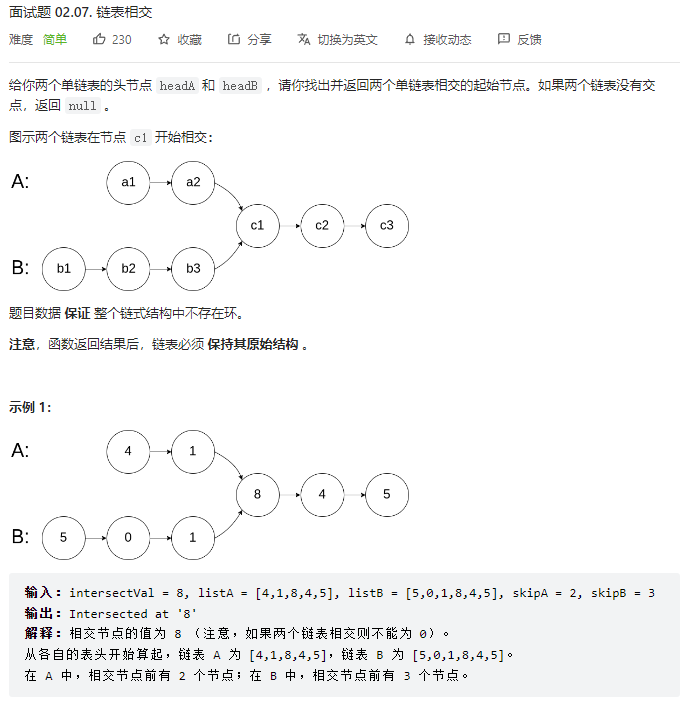

```js
 // A链表走完再走B链表 B链表走完再走A链表，若相交必相遇
var getIntersectionNode = function(headA, headB) {
    let A = headA;
    let B = headB;
    while(A != B) {
        A = A ? A.next : headB;// A若不为空则指向A.next，若为空则指向headB B同理
        B = B ? B.next : headA;
    }
    return A;
};
```

### 4.环形链表


```js
var hasCycle = function(head) {
    let slow = head;// 设置快慢指针
    let fast = head;
    while(true) {
        if(fast == null || fast.next == null) return false;// fast指针遍历到表尾了 所有无环
        slow = slow.next;
        fast = fast.next.next;
        if(fast === slow) return true;// 相遇则说明成环
    }
};
```

### 5.回文链表


```js
var isPalindrome = function(head) {
    let nums = [];// 创建一个数组保存链表值
    while(head) {// 遍历链表
        nums.push(head.val)// 将链表值存入nums数组
        head = head.next;
    }
    for(let i = 0; i < nums.length / 2; i++) {// 遍历数组  也可以用双指针遍历
        if(nums[i] != nums[nums.length - 1 - i]) return false;// 判断头尾值是否相等 不等返回false
    }
    return true;
};
```


### 6.柠檬水找零


```js
var swapPairs = function(head) {
    let dummy = new ListNode(0, head);// 创建一个虚拟节点头指向head
    let p = dummy;// p 指向虚拟节点头
    while(head && head.next) {// 接下来判断当前节点和下一个节点是否为空
        let tmp = head.next.next;// 先把要交换的两个节点的下一个节点保存起来
        p.next = head.next;// p虚拟节点头的next指向要交换的第二个节点 即head.next
        head.next.next = head;// 要交换的第二个节点的next指针指向第一个节点
        head.next = tmp;// 第一个节点的next指向下一次遍历的节点tmp
        p = head;// p指向当前交换完的第二个节点
        head = tmp;// head指向下一次交换的第一个节点
    }
    return dummy.next;
};
```


## 栈和队列

### 1.用栈来实现队列


```js
var MyQueue = function() {
    this.stackIn = [];
    this.stackOut = [];
};
/** 
 * @param {number} x
 * @return {void}
 */
MyQueue.prototype.push = function(x) {
    this.stackIn.push(x);
};
/**
 * @return {number}
 */
MyQueue.prototype.pop = function() {
    let size = this.stackOut.length;//获取输出栈的大小
    if(!size) {//输出栈若栈空
        while(this.stackIn.length) {//判断输入栈是否为空，不为空则把输入栈的元素一个个放进输出栈
            this.stackOut.push(this.stackIn.pop())
        }
    }
    return this.stackOut.pop();//返回输出栈 栈顶元素
};
/**
 * @return {number}
 */
MyQueue.prototype.peek = function() {
    const x = this.pop();//利用本队列的pop()获取队头
    this.stackOut.push(x);//再把对头放回去stackOut
    return x;//返回队头元素
};
/**
 * @return {boolean}
 */
MyQueue.prototype.empty = function() {
    if(this.stackOut.length === 0 && this.stackIn.length === 0) return true;
    else return false;
};
```

```java
class MyQueue {
    //用两个栈来实现队列 一个输入栈 一个输出栈
    Stack<Integer> stackIn = new Stack();
    Stack<Integer> stackOut = new Stack();
    public MyQueue() {

    }
    
    public void push(int x) {
        stackIn.push(x);//直接加入输入栈
    }
    
    public int pop() {
        if(stackOut.isEmpty()){//出栈前 先判断输出栈是否为空，若为空
            while(!stackIn.isEmpty()){//再判断输入栈是否为空 不为空则把输入栈数据一个个push进输出栈，要一次性push
                stackOut.push(stackIn.pop());
            }
        }
        return stackOut.pop();//返回输出栈栈顶元素 并pop  peek操作同理
    }
    
    public int peek() {
        if(stackOut.isEmpty()){
            while(!stackIn.isEmpty()){
                stackOut.push(stackIn.pop());
            }
        }
        return stackOut.peek();
    }
    
    public boolean empty() {
        if(stackIn == null && stackOut == null) return true;
        else return false;
    }
}
```

### 2.有效的括号


```js
var isValid = function(s) {
    let stack = [];
    for(let i = 0; i < s.length; i++) {
        let c = s[i];
        switch(c) {
            case '(' : 
                stack.push(')');
                break;
            case '[' :
                stack.push(']');
                break;
            case '{' :
                stack.push('}');
                break;
            default :
                if(c !== stack.pop()) {
                    return false;
                }
        }
    }
    return stack.length === 0;
};
```

```java
class Solution {
    public boolean isValid(String s) {
        Stack<Character> stack = new Stack<>();
        for(char c : s.toCharArray()){
            if(c == '('){
                stack.push(')');
            }else if(c == '['){
                stack.push(']');
            }else if(c == '{'){
                stack.push('}');
            }else{
                if(stack.isEmpty() || stack.peek() != c) return false;
                else stack.pop();
            }
        }
        return stack.isEmpty();
    }
}
```

### 3.删除字符串中的所有相邻重复项


```java
class Solution {
    public String removeDuplicates(String s) {
        Stack<Character> stack = new Stack();
        for(char c : s.toCharArray()){
            if(stack.isEmpty() || stack.peek() != c){
                stack.push(c);
            }else{//栈非空 而且 栈顶元素不等于c，则出栈
                stack.pop();
            }
        }
        String str = "";
        while(!stack.isEmpty()){
            str = stack.pop() + str;//反向添加字符
        }
        return str;
    }
}
```

### 4.逆波兰表达式求值


```js
var evalRPN = function(tokens) {
    let map = new Map([
        ["+", (a, b) => a * 1  + b * 1],
        ["-", (a, b) => b - a],
        ["*", (a, b) => b * a],
        ["/", (a, b) => (b / a) | 0]
    ]);
    let stack = [];
    for(item of tokens) {
        if(!map.has(item)) {
            stack.push(item);   
        }else{
            stack.push(map.get(item)(stack.pop(), stack.pop()));
        }
        
    }
    return stack.pop();
};
```

```java
class Solution {
    public int evalRPN(String[] tokens) {
        Stack<Integer> stack = new Stack();
        for(String c : tokens){
            if("+".equals(c)){
                stack.push(stack.pop() + stack.pop());
            }else if("-".equals(c)){
                stack.push(-stack.pop() + stack.pop());
            }else if("*".equals(c)){
                stack.push(stack.pop() * stack.pop());
            }else if("/".equals(c)){
                int tmp1 = stack.pop();
                int tmp2 = stack.pop();
                stack.push(tmp2 / tmp1);
            }else{
                stack.push(Integer.valueOf(c));
            }
        }
        return stack.pop();
    }
}
```

### 5.滑动窗口的最大值

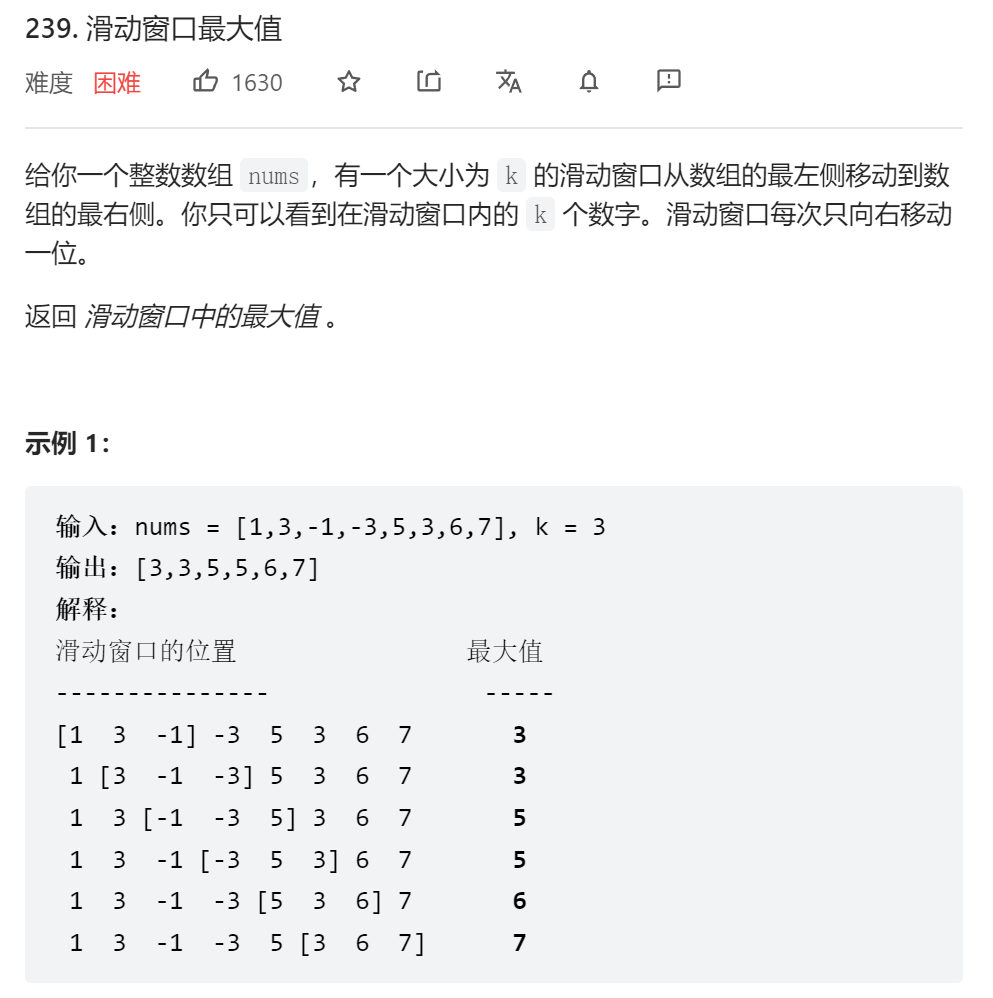

```java
class Solution {
    public int[] maxSlidingWindow(int[] nums, int k) {
        
        int[] res = new int[nums.length - k + 1];
        for(int i = 0; i < nums.length - 2; i++) {
            int sum = 0;
            int max = Integer.MIN_VALUE;
            for(int j = i; j < i + k; j++) {
                // sum += nums[j];
                max = Math.max(nums[j], max);
            }
            res[i] = max;
        }
        return res;
    }
}
```

### 6.前k个高频元素


```js
var topKFrequent = function(nums, k) {
    let map = new Map();//创建map
    nums.forEach((item) => {//遍历数组
        map.set(item, map.has(item) ? map.get(item) + 1 : 1);//将数字和数字出现的次数存入map
    });
    //将map转换为数组，再进行定制排序，按值排序 值大排前面
    let arr = Array.from(map).sort((a, b) => b[1] - a[1]);
    //切割数组，再进行map遍历 返回第一个元素 即map中的key(数字)
    return arr.slice(0, k).map((item) => item[0]);
};
```


```js
var topKFrequent = function(nums, k) {
    let obj = {};
    nums.forEach((item) => {//遍历数组 记录每个数字出现的次数
        if(obj[item]){//若已经存在该数字属性 则次数加1
            obj[item]++;
        }else{//若不存在 则设置为1
            obj[item] = 1;
        }
    })
    let arr = [];//声明一个数组
    for(let key in obj) {//遍历对象的key
        arr.push({//把对象的key 和 value 存入数组
            key,
            value: obj[key]
        })
    };
    function dataSort(a, b) {//声明定制排序函数
        //对数组中的value进行排序 逆序return b.value - a.value
        //对数组中的value进行排序 正序return a.value - b.value
        return b.value - a.value;
    }
    arr.sort(dataSort);//对数组进行排序
    //切割前k个最高频的元素，利用map遍历返回key
    return arr.slice(0, k).map((item) => item.key);
};
```


```java
class Solution {
    public int[] topKFrequent(int[] nums, int k) {
        int[] res = new int[k];
        Map<Integer, Integer> map = new HashMap();
        for(int num : nums){//用map记录数字出现次数
            map.put(num, map.getOrDefault(num, 0) + 1);
        }
        //构造优先队列并定制以map的value值来排序 形成小顶堆
        PriorityQueue<Map.Entry<Integer, Integer>> queue = new PriorityQueue<>((o1, o2) -> o1.getValue() - o2.getValue());
        for(Map.Entry<Integer, Integer> entry : map.entrySet()){//遍历map
            queue.offer(entry);
            if(queue.size() > k){//超出所需要的k个元素 就把前面的次数小的出队
                queue.poll();
            }
        }
        for(int i = 0; i < k; i++){//将key放入数组容器中 返回
            res[i] = queue.poll().getKey();
        }
        return res;
    }
}
```


## 字符串

### 1.反转字符串


```js
//1
var reverseString = function(s) {
    for(let i = 0; i < s.length / 2; i++) {//遍历到中间为止
        [s[i], s[s.length - 1 - i]] = [s[s.length - 1 - i], s[i]]//解构赋值，两两交换
    }
};
//2
var reverseString = function(s) {
    let l = 0, r = s.length - 1;
        while(l < r) {
            [s[l], s[r]] = [s[r], s[l]];
            l++;
            r--;
        }
};
//3
var reverseString = function(s) {
	return s.reverse();
};
```

```java
class Solution {
    public void reverseString(char[] s) {
        int n = s.length;
        for(int i = 0, j = n - 1; i < j; i++, j--){
            char tmp = s[i];
            s[i] = s[j];
            s[j] = tmp;
        }
    }
}
```

### 2.反转字符串Ⅱ


```js
var reverseStr = function(s, k) {
    for(let i = 0; i < s.length; i += 2*k) {
        let start = i;//记录每一次跨越2k个字符的起始下标
        let end = Math.max(s.length - 1, start + k - 1);//记录每次跨越2k个字符的结尾小标
        while(start < end) {
            [s[start], s[end]] = [s[end], s[start]];//用解构赋值来交换前后位置字符
            start++;
            end--;
        }
    }
    return s;
};
```

```java
class Solution {
    public String reverseStr(String s, int k) {
        char[] str = s.toCharArray();//字符串转为字符串数组
        for(int i = 0; i < str.length; i += 2*k){
            int start = i;//记录每一次跳转2k后的起始位置
            //跳转到2k后的末尾位置，它可能超出字符长度
            int end = Math.min(str.length - 1, start + k - 1);
            while(start < end){//每个2k区间中的前k个进行交换
                char tmp = str[start];
                str[start] = str[end];
                str[end] = tmp;
                start++;
                end--;
            }
        }
        return new String(str);
    }
}
```


### 3.替换空格

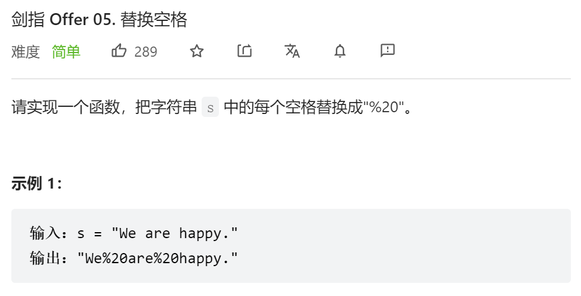

```js
/**
 * @param {string} s
 * @return {string}
 */
var replaceSpace = function(s) {
    let str = '';//定义一个空字符串 存放新字符串
    for(let i = 0; i < s.length; i++) {
        //若当前s[i]字符为空格则用%20替换 若不是空格则直接添加s[i]对应的字符
        str += s[i] === ' ' ? '%20' : s[i];
    }
    return str;
};
```

```java
class Solution {
    public String replaceSpace(String s) {
        StringBuilder sb = new StringBuilder();//创建StringBuilder对象
        for(int i = 0; i < s.length(); i++){//遍历字符串
            if(s.charAt(i) == ' '){//当前字符若为空，则添加%20
                sb.append("%20");
            }else{//若不为空，则添加当前字符
                sb.append(s.charAt(i));
            }
        }
        return sb.toString();//返回的同时转换为String
    }
}
```

### 4.颠倒字符串中的单词


```js
var reverseWords = function(s) {
    s.trim();
    let str = '';
    let i = s.length - 1;
    let j = s.length - 1;
    while(i >= 0) {
        while(i >= 0 && s[i] != ' '){
            i--;
        }
        str += s.substring(i + 1, j + 1) + ' ';
        while(i >= 0 && s[i] == ' ') {
            i--;
        }
        j = i;
    }
    return str.trim();
};
```


```Java
class Solution {
    public String reverseWords(String s) {
        StringBuilder sb = new StringBuilder();//StringBuilder对象存储新字符串
        s.trim();//清空两边的空格
        int i = s.length() - 1;//i j 分别从最后一个字符开始遍历
        int j = s.length() - 1;
        while(i >= 0){
            while(i >= 0 && s.charAt(i) != ' '){//当前字符若非空格，则i前移
                i--;
            }
            sb.append(s.substring(i + 1, j + 1) + ' ');//当前字符为空格 则把单词加入sb中并加上空格
            while(i >= 0 && s.charAt(i) == ' '){//接下来继续判断当前字符前面的字符是否为空格继续遍历
                i--;
            }
            j = i;//遇到非空格 则为下一个单词的结尾
        }
        return sb.toString().trim();//清空右侧的空格
    }
}
```

### 5.左旋转字符串Ⅱ


```js
//1
var reverseLeftWords = function(s, n) {
    return s.substring(n, s.length) + s.substring(0, n);
};
//2
var reverseLeftWords = function(s, n) {
    str = '';
    for(let i = n; i < s.length; i++) {
        str += s[i];
    }
    for(let i = 0; i < n; i++){
        str += s[i];
    }
    return str;
};
```

```java
//1
class Solution {
    public String reverseLeftWords(String s, int n) {
        StringBuilder sb = new StringBuilder();
        for(int i = n; i < s.length(); i++){
            sb.append(s.charAt(i));
        }
        for(int i = 0; i < n; i++){
            sb.append(s.charAt(i));
        }
        return sb.toString();
    }
}
//2
class Solution {
    public String reverseLeftWords(String s, int n) {
        return s.substring(n, s.length()) + s.substring(0, n);
    }
}
```

6.重复的子字符串


```js
/**
   模拟优化
   我们不需要去比较每i个字符串
   我们只需要比较前i个和后i个
   以及i到最后一个和前n-i个是否相等
*/
var repeatedSubstringPattern = function(s) {
    let n = s.length;//字符串长度
    let i = 0;//开始位
    while(++i < n) {//i++后判断是否小于字符长度n
        if(n % i != 0) continue;//重复字串长度i是否是字符串长度n的整数倍,不是整数倍就继续循环
        //判断0，i 和 n-i到n 是否相同
        if(s.substring(0, i) === s.substring(n - i, n)) {
            // 判断去掉前或者后的重复字串 剩下的是否相同
            if(s.substring(i, n) === s.substring(0, n - i)) {
                return true;
            }
        }
    }
    return false;//z
};
```


```java
·class Solution {
    public boolean repeatedSubstringPattern(String s) {
        int n = s.length();//字符长度
        int i = 1;//开始位
        while (++i < n) {//i++后判断是否小于字符长度n
            if (n % i != 0) continue;//重复字串长度i是否是字符串长度n的整数倍,不是整数倍就继续循环
            //判断0，i 和 n-i到n 是否相同
            if (s.substring(n - i, n).equals(s.substring(0, i)))
                // 判断去掉前或者后的重复字串 剩下的是否相同
                if (s.substring(i, n).equals(s.substring(0, n - i))) return true; 
        }
        return false;
    }
}
```

### 7.同构字符串

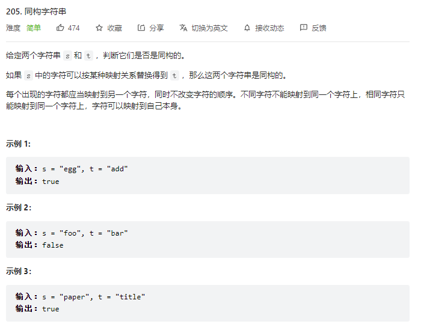

```js
var isIsomorphic = function(s, t) {
    let mapS = {};
    let mapT = {};
    // 每个字符的映射都是唯一的对应关系
    for(let i = 0; i < s.length; i++) {
        if(!mapS[s[i]]) mapS[s[i]] = t[i];// 如果s[i]还没映射的话，s映射到t
        if(!mapT[t[i]]) mapT[t[i]] = s[i];// 如果t[i]还没映射，则t映射s
        if(mapS[s[i]] !== t[i] || mapT[t[i]] !== s[i]) return false;// 判断双向映射是否一一对应
    }
    return true;
};
```

## 双指针

### 1.长按键入


```js
var isLongPressedName = function(name, typed) {
    let i = 0;
    let j = 0;
    while(j < typed.length) {// 循环遍历 
        if(name[i] === typed[j]) {// 如果name和type当前位置的元素一样 则同时前移
            i++;
            j++;
        } else {// 如果不一样
            if(typed[j] === typed[j - 1]) {// 判断type的当前元素是否和它自身的前一个是否一样
                j++;// 一样则j前移
            } else {// 不一样说明不是长按
                return false;
            }
        }
    }
    return name[i] === typed[j];// 结果还要对比name和typed的最后一个元素是否一致
};
```

### 2.按奇偶排序数组 II

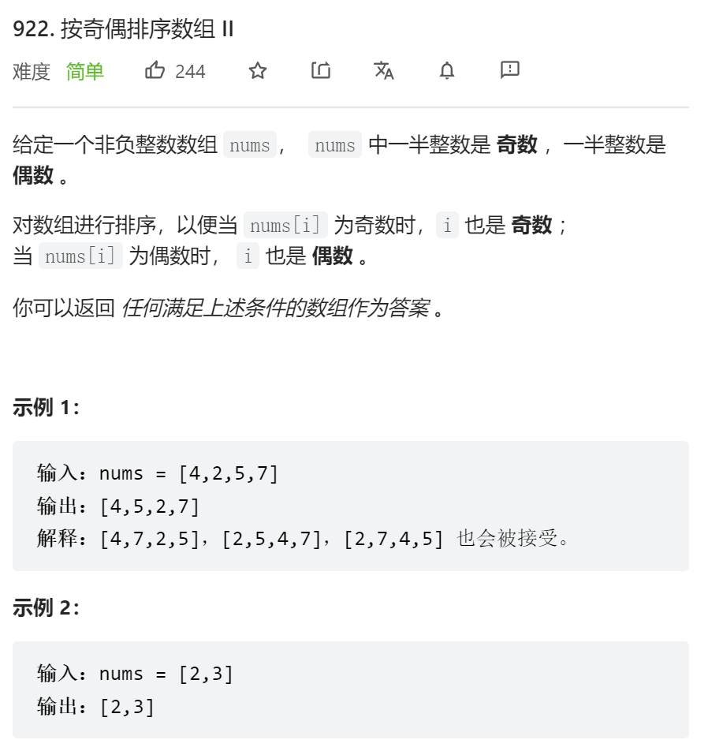

```js
var sortArrayByParityII = function(nums) {
    let res = [];// 创建一个数组保存结果
    let even = 0;
    let odd = 1;
    nums.forEach((item) => {
        if(item % 2 === 0) {// 奇数存进奇数奇数下标
            res[even] =  item;
            even = even + 2;// 奇数指针+2
        }else {// 偶数存进偶数下标
            res[odd] = item;
            odd = odd + 2;// 偶数下标+2
        }
    })
    return res;
};
```

### 3.移动零


```js
var moveZeroes = function(nums) {
    let l = 0;// 双指针 l记录0的位置
    let r = 0;
    while(r < nums.length) {
        if(nums[r] === 0) {// 当前值如果等于0 则l不动 r前移
            r++;
        } else {// 如果不等于0 
            nums[l] = nums[r];// 将当前值nums[r]存到l的位置 l,r同时前移
            l++;
            r++;
        }
    }
    for(let i = l; i < nums.length; i++) {// 把剩下的全置为0
        nums[i] = 0;
    }
    return nums;
};
```

### 4.有效的山脉数组


```js
var validMountainArray = function(arr) {
    if(arr.length < 3) return false;
    let n = arr.length;
    let l = 0;
    let r = arr.length - 1;
    while(l < n && arr[l + 1] > arr[l]) l++;// 左边爬坡
    while(r > 0 && arr[r - 1] > arr[r]) r--;// 右边爬坡
    if(l === r && l != 0 && r != n - 1) return true;
    else return false;
};
```

