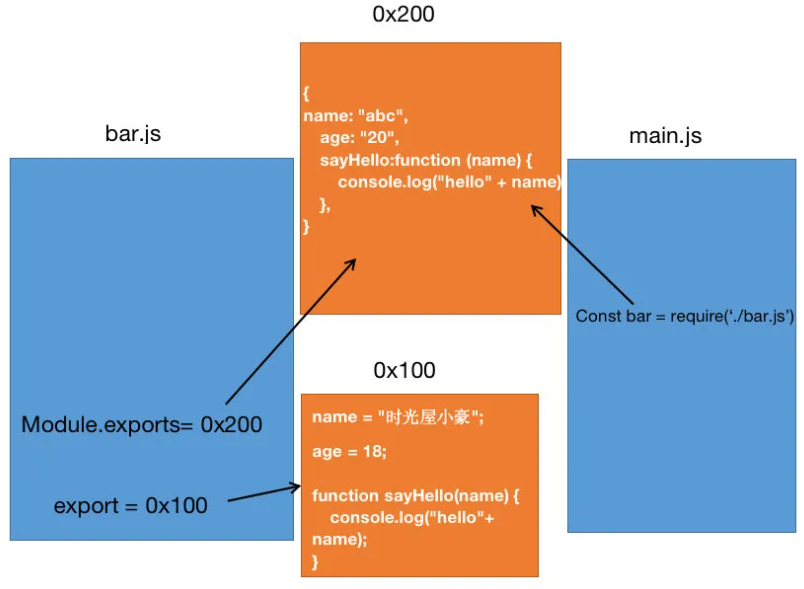

# node与模块化开发

## 前言

看完本文可以掌握，以下几个方面：

- 什么是模块化，以及没有模块化会带来哪些问题，是如何解决的;
- JavaScript的设计缺陷;
- CommonJS规范;
- 它的规范特性;
- 如何配合Node完成模块化开发;
- exports如何导出的;
- module.exports是如何导出变量的，值类型和引用类型导出间的差异;
- 从内存角度深度分析module.exports和exports又有怎样的区别和联系;
- require的细节，以及模块的加载执行顺序;
- CommonJS的加载过程;
- CommonJS规范的本质;

## 1.什么是模块化

模块化开发最终的目的是将程序划分成一个个**小的结构**，也就是将大文件切分为小文件，每个小文件通过依赖关系形成连接

- 在这个结构中编写**属于自己**的逻辑代码，有自己的作用域，**不会影响到其他的结构**;
- 这个结构可以将自己希望暴露的变量、函数、对象等导出给其结构使用;
- 也可以通过某种方式，导入另外结构中的变量、函数、对象等;

上面说提到的结构，就是模块；按照这种结构划分开发程序的过程，就是模块化开发的过程;

## 2.JavaScript设计缺陷

缺陷：

- var定义的变量作用域问题，命名冲突;

  > 以前每个.js文件并不是一个独立的模块，没有自己的作用域，所以在.js文件中定义的变量，都是可以被其他的地方共享的

- JavaScript的面向对象并不能像常规面向对象语言一样使用class;

- 在早期JavaScript并没有模块化的问题，所以也就没有对应的模块化解决方案;

什么导致模块化的出现：

- **ajax**的出现，前后端开发分离，意味着后端返回数据后，我们需要通过JavaScript进行前端页面的渲染;
- **SPA**（单页面应用）的出现，前端页面变得更加复杂：包括前端路由、状态管理等等一系列复杂的需求需要通过JavaScript来实现;
- 包括**Node**的实现，JavaScript编写复杂的后端程序，没有模块化是致命的硬伤;

**模块化规范**：AMD、CMD、CommonJS、ES module

## 3.CommonJS

CommonJS是一个模块化规范

- Node是CommonJS在服务器端一个具有代表性的实现;
- Browserify是CommonJS在浏览器中的一种实现;
- webpack打包工具具备对CommonJS的支持和转换;

Node中对CommonJS进行了支持和实现，所以它具备以下几个特点;

- 在Node中每一个js文件都是一个单独的模块;
- 该模块中，包含CommonJS规范的核心变量: exports、module.exports、require;
- 使用核心变量，进行模块化开发;

模块化的核心是导出和导入，Node中对其进行了实现：

- **exports**和**module.exports**可以负责对模块中的内容进行导出;
- **require**函数可以帮助我们导入其他模块(自定义模块、系统模块、第三方库模块)中的内容;

### 3.1exports导出

exports是一个对象，我们可以在这个对象中添加很多个属性，添加的属性会导出。

**1。创建bar.js**文件

```js
const name = "1111"; 
const age = 18; 
 
function sayHello(name) { 
  console.log("hello" + name); 
} 
// 导出变量和函数
exports.name = name; 
exports.age = age; 
exports.sayHello = sayHello;
```

**2。把bar.js导入main.js文件中**  使用require导入

```js
const bar = require('./bar'); // 导入模块
console.log(bar.name);  // 1111 
console.log(bar.age);   // 18 
```

需要注意的是 main.js中的**bar**变量等于exports对象;

### 3.2从内存角度分析bar和exports是同一个对象

在Node中，有一个特殊的全局对象，其实exports就是其中之一。

如果在文件内，不再使用exports.xxx的形式导出某个变量的话，其实exports就是一个空对象。

**模块间的引入关系**


- 当我们在main.js中require导入的时候，它会去自动查找特殊的全局对象exports，并且把require函数的执行结果赋值给bar;
- bar和exports指向**同一个引用**(引用**地址**相同);
- 如果发现exports上有变量，则会放到bar对象上，正因为这样我们才能从bar上读取想用的变量;

> Node中实现CommonJS规范的本质就是对象的引用赋值(浅拷贝本质)。
>
> require只是把exports对象的引用地址赋值给bar

### 3.3require细节

require本质是一个函数，用来引入模块

模块的加载顺序

1.模块在被第一次引入时，模块中的js代码会被运行一次

2.模块被多次引入时，会缓存，最终只加载(运行)一次

> 为什么只会加载运行一次呢?
>
> - 每个模块对象module都有一个属性：loaded;
> - 为false表示还没有加载;
> - 为true表示已经加载;

3.如果有循环引入，那么加载顺序是什么?

node会采用深度优先算法遍历，并把加载过的模块存入缓存，循环引用时直接取缓存，不会一直循环下去

### 3.4加载机制

1. 先计算模块路径（查找当前目录的node_modules，没有再找上一级node_modules）
2. 如果模块在缓存里面，取出缓存
3. 判断是否为内置模块，是直接返回
4. 生成模块实例var module =**new** **Module**()，存入缓存
5. 加载模块**module.load()**
6. 输出模块的exports属性即可 ----return mdule.exports

## 4.module.exports

以下是通过维基百科对CommonJS规范的解析：

- CommonJS中是没有module.exports的概念的;
- 但是为了实现模块的导出，Node中使用的是Module的类，每一个模块都是Module的一个实例对象module;
- 所以在Node中真正用于导出的其实根本不是exports，而是**module.exports**;
- exports只是module上的一个对象

但是，为什么exports也可以导出呢?

- 这是因为module对象的exports属性是exports对象的一个引用;

```js
function Module(id, parent) {
  this.id = id;
  this.exports = {};// 指向一个空对象的地址，同时exports也指向这个对象的地址
  this.parent = parent;
  this.filename = null;
  this.loaded = false;// 记录模块是否被加载过 作缓存时需要判断
  this.children = [];
}

module.exports = Module;
var module = new Module(filename, parent);
```

- 等价于module.exports = exports = main中的bar(CommonJS内部封装);

**真正导出的模块内容的核心其实是module.exports，只是为了实现CommonJS的规范，刚好module.exports对exports对象使用的是同一个引用而已**

### 4.1😀module.exports与exports的区别

在我们使用require()导入模块的时候，模块加载真正返回的是**module.exports**而不是exports，module.exports才是真正的接口，exports只不过是它的一个辅助工具，返回的module.exports 初始值为一个空对象 {}，而exports为指向module.exports 的引用（只是拿到引用地址）。如果要导出对象、函数、数组（js中函数、数组也是对象）必须要用module.exports，不能用exports（为什么不能？因为如果用exports则把exports的引用地址修改了，那么它就不再指向module.exports了，不指向module.exports，那么exports怎么修改也影响不了module.exports，因此require导入的模块返回的还是module.exports，它根本没有被修改），所以一般是导出属性才用exports，但是开发中最好都用module.exports，这样的话你只需要记忆一种方法。


对以上导出方式的解释：

- 因为module.exports = { xxx }这样的形式，会在堆内存中新开辟出一块内存空间，会生成一个新的对象，用它取代之前的exports对象的导出

- module.exports 也就和 exports没有任何关系了;
- 无论exports怎么改，都不会影响最终的导出结果;
- 那么也就意味着require导入的对象是新的对象;



module.exports导出的对象变量是值类型或者引用类型是有区别的，引用类型是可以被修改的

## 5.Es Module

前面讲的都是CommonJS规范，Es Module借鉴了CommonJS，从 ES6 开始， JavaScript 才真正意义上有自己的模块化规范。

ES6导出的不是对象，无法引用模块本身，模块的方法单独加载。因此可以在编译时加载（也即静态加载），因而可以进行静态分析，在编译时就可以确定模块的依赖关系和输入输出的变量，提升了效率。

而CommonJS和AMD输出的是对象，引入时需要查找对象属性，因此只能在运行时确定模块的依赖关系及输入输出变量（即运行时加载），因此无法在编译时做“静态优化”。

目前的应用

- 借助 Es Module 的静态导入导出的优势，实现了 tree shaking。
- Es Module 还可以 import() 懒加载方式实现代码分割。

### 5.1导出 export 和导入 import

所有通过 export 导出的属性，在 import 中可以通过结构的方式，解构出来。

#### 5.1.1正常导入导出

直接导出，只能是这三种形式，这三种是等价的。注意export后面不能接一个常量，因为export要输出的是接口，要和变量一一对应

```js
export { name, author }
export var name = xxx
export function say = xxx
```

也可以使用别名的方式导出   变量名后面加as，如

```js
{ name, author as  bookAuthor } from './a.js' 
```

导出模块a.js

```js
const name = '《React进阶实践指南》'  
const author = '111' 
export { name, author } 
export const say = function (){ 
    console.log('hello , world') 
} 
```

导入到模块main.js中

```js
// name , author , say 对应 a.js 中的  name , author , say 
import { name , author , say } from './a.js' 
```

#### 5.1.2默认导出 export default

- export default anything 导入 module 的默认导出。anything 可以是函数，属性方法，或者对象。
- 对于引入默认导出的模块，import anyName from 'module'， anyName 可以是自定义名称。
- export default的导出方式，只会简单地把要导出的变量放在对象里。

导出模块a.js

```js
const name = '《React进阶实践指南》' 
const author = '111' 
const say = function (){ 
    console.log('hello , world') 
} 
export default { 
    name, 
    author, 
    say 
} 
```

导入到模块main.js中

```js
import anyName from './a.js' 
console.log(anyName) //{ name: '《React进阶实践指南》',author:'111', say:Function } 
```

#### 5.1.3混合导入导出

上面两种混合一起用

#### 5.1.4动态导入

```js
const promise = import('module路径') 
```

- import('module')，动态导入返回一个 Promise实例。为了支持这种方式，需要在 webpack 中做相应的配置处理。一般vue和react的脚手架应该是已经配置好了的

**import** 这种静态语法，在编译过程中确定了导入和导出的关系，所以更方便去查找依赖，更方便去 tree shaking (摇树) 

## 两者的区别

CommonJS导出的是对象，内部要导出的变量如果是基本数据类型，那么在导出的那一刻就已经赋值给对象的属性了，如果导出变量是引用类型，则会受原模块的影响。正因为导出的是对象，所以编译阶段不会读取对象内容，并不清楚对象内部都导出了哪些变量、这些变量是不是从别的文件导入进来的。只有等到代码运行时才能访问对象的属性，确定依赖关系。因此才说CommonJS的模块是**动态加载**的。

ES6 Module来说，由于内部对每个变量都定义了getter，因此其他模块导入后访问变量时触发getter，返回模块里的同名变量，如果变量值发生变化，则外边的引用也会变化。ES6 Module导出的是一个个接口getter，因此在编译时就能确定模块之间的依赖关系，所以才说ES6 Module是**静态加载**的。Tree Shaking就是根据这个特性在编译阶段摇掉无用模块的。

ES6 Module还提供了一个import()方法动态加载模块，返回一个Promise。

### CommonJs

- CommonJs可以动态加载语句，代码发生在运行时
- CommonJs混合导出，还是一种语法，只不过不用声明前面对象而已，当我导出引用对象时之前的导出就被覆盖了
- CommonJs导出值是拷贝，可以修改导出的值，这在代码出错时，不好排查引起变量污染

### Es Module

- Es Module是静态的，不可以动态加载语句，只能声明在该文件的最顶部，代码发生在编译时
- Es Module混合导出，单个导出，默认导出，完全互不影响
- Es Module导出是引用值之前都存在映射关系，并且值都是可读的，不能修改

